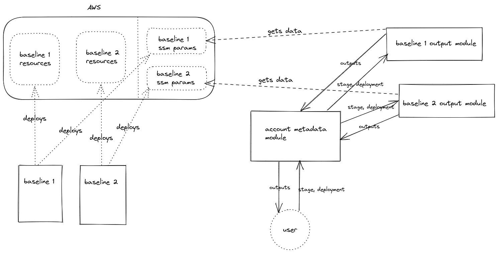
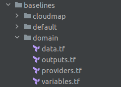

# terraform-aws-ohp-account-metadata

Terraform module to retrieve and output AWS account metadata and baseline resources

<!-- TOC -->
* [terraform-aws-ohp-account-metadata](#terraform-aws-ohp-account-metadata)
  * [Introduction](#introduction)
    * [Metadata](#metadata)
    * [Baselines](#baselines)
  * [How to use](#how-to-use)
    * [Examples](#examples)
      * [Output only account metadata](#output-only-account-metadata)
      * [Output account metadata and info from CloudMap baseline](#output-account-metadata-and-info-from-cloudmap-baseline)
    * [Overriding stage and deployment](#overriding-stage-and-deployment)
      * [Override default stage](#override-default-stage)
      * [Override stage/deployment per baseline](#override-stagedeployment-per-baseline)
      * [Overriding inputs hierarchy](#overriding-inputs-hierarchy)
      * [Variable standard](#variable-standard)
  * [How to contribute](#how-to-contribute)
    * [Metadata output module](#metadata-output-module)
    * [Baseline output modules](#baseline-output-modules)
    * [Files](#files)
    * [Output standard](#output-standard)
<!-- TOC -->
## Introduction
This module facilitates the output of (meta)data related to the AWS account you are deploying to.   
Thanks to this module, you don't have to fetch account metadata or resource IDs, ARNs, names, IPs manually or via separate data sources.
After specifying a few simple inputs, the module will retrieve them for you in the form of outputs that you can reference in your Terraform code.



### Metadata
Metadata is useful information about the account - client, stage, AWS account id, AWS account name etc.
Metadata retrieval is enabled by default.

### Baselines
Baselines are AWS modules that create standard infrastructure in our AWS accounts and are usable by multiple applications.   
Examples:
  - VPC
  - subnets
  - domains
  - ECS clusters
  - CloudMap namespace
  - ...

After providing the correct inputs, you should receive the correct resource outputs for the given baseline.
Baseline retrieval is disabled by default, and can be enabled per baseline.

## How to use
1. Read the documentation to check which inputs and outputs are available
2. Call module in your Terraform code
   1. Check the snippets in [example](example) directory for how to best use this module
3. Use outputs from the module in your locals and resources
   1. If your IDE allows it, code completion can be used for module outputs, simplifying writing the code
   2. Outputs have a default value, mostly null - in case output module is disabled, use [coalesce](https://www.terraform.io/language/functions/coalesce) to set a manual value, e.g. coalesce(module.account_metadata.account_id, var.account_id). In the example, var.account_id, only needs a value set, if module output is null.
### Examples
#### Output only account metadata
Metadata is retrieved without the necessity of providing any inputs.
```hcl
module "account_metadata" {
  source = "git::github.com/ohpensource/terraform-aws-ohp-account-metadata.git?ref=<version>"
}
locals {
  account_id = coalesce(module.account_metadata.account_id, var.account_id)
}
```
#### Output account metadata and info from CloudMap baseline
Call the module from within your Terraform code. Define which outputs you want to enable.
```hcl
module "account_metadata" {
  source = "git::github.com/ohpensource/terraform-aws-ohp-account-metadata.git?ref=<version>"
  cloudmap = {
    enable = true
  }
}
resource "aws_service_discovery_service" "example" {
  name = "example"
  namespace_id = coalesce(module.account_metadata.cloudmap_namespace_id, var.cloudmap_namespace_id)
}
```

### Overriding stage and deployment
An AWS account will usually contain baselines only for one stage and one default deployment.
Under these standard circumstances, this module retrieves the stage of the account for you, minimizing your required inputs.   
   
Some accounts, however, may contain baselines from multiple stages, or multiple deployments. In order to fetch the correct data, you need to provide the correct inputs.

#### Override default stage
Best used in an account with multiple stages (tst, acc, prd).
Module will use your defined stage instead of the default stage of the AWS account for retrieving baseline outputs.
In case metadata functionality is disabled, you must provide a stage value.
```hcl
module "account_metadata" {
  source = "git::github.com/ohpensource/terraform-aws-ohp-account-metadata.git?ref=<version>"
  stage = "tst" # Overrides value retrieved by module
  cloudmap = {
    enable = true
  }
}
```
#### Override stage/deployment per baseline
In some very special cases (e.g. development), you may need baselines with a combination of stages and deployments.
```hcl
module "account_metadata" {
  source = "git::github.com/ohpensource/terraform-aws-ohp-account-metadata.git?ref=<version>"
  stage = "tst" # Overrides default stage retrieved by module
  cloudmap = {
    enable = true # Uses stage from stage variable and default deployment
  }
  network = {
    enable = true
    stage  = "dev" # Overrides stage
  }
  domain = {
    enable     = true
    deployment = "b" # Overrides default value "main", uses stage
  }
  ecs = {
    enable     = true
    stage      = "acc" # Overrides stage
    deployment = "c"   # Overrides default value "main"
  }
}
```
#### Overriding inputs hierarchy 
1. If stage or deployment are specified on baseline variable level (e.g. CloudMap), they take precedence
2. If stage is specified, it overrides default stage retrieved by this module from account metadata
3. If no special stage and deployment are specified, stage is retrieved by this module, and default deployment "main" is used

#### Variable standard
Given that overriding may be a reality for the deployment of your application, best prepare for it.
Look into the example repo, for a variable and module call, that you may copy-paste and update as you need.

### Provider considerations
If you are setting default provider tags with outputs retrieved by this module, you must [create a separate provider](https://www.terraform.io/language/modules/develop/providers) with an alias and add it to the providers section of the module call.
```hcl
provider "aws" {
  alias = "account_metadata_provider"
}
module "account_metadata" {
  source = "git::github.com/ohpensource/terraform-aws-ohp-account-metadata.git?ref=<version>"
  providers = {
    aws = aws.account_metadata_provider
  }
}
```

## How to contribute
1. Create a PR
2. Request review from codeowners
3. If approved, merge

### Metadata output module
- In separate submodule
- in metadata directory
- Requires no inputs
### Baseline output modules
- Retrieval of data is in separate submodules, currently in this repo
- Metadata in metadata directory
  - Requires no inputs, retrieved metadata may be used by other submodules, e.g. stage
- Baselines in baselines directory   
   
  - Stage and deployment mandatory variables
  - Data source definitions should be here
  - Outputs which are passed down to the main module

### Files
- Add variables into variables.tf file
- If you are adding a new baseline, create a _baseline_name.tf file for it
  - Add baseline output module call, locals and final outputs in the file

### Output standard
- Output names should make it clear what they are outputting
- Description should be in format "baseline - wordier description" for a pleasant documentation reading experience
- Use [try](https://www.terraform.io/language/functions/try) to provide a default value (e.g. null)
```hcl
output "cloudmap_read_write_policy_arn" {
  description = "cloudmap - CloudMap read-write IAM policy ARN"
  value       = try(module.cloudmap[0].cloudmap_read_write_policy_arn, null)
}
```
<!-- BEGIN_TF_DOCS -->
## Requirements

No requirements.

## Providers

No providers.

## Modules

| Name | Source | Version |
|------|--------|---------|
| <a name="module_domain"></a> [domain](#module\_domain) | ./baselines/domain | n/a |
| <a name="module_metadata"></a> [metadata](#module\_metadata) | ./metadata | n/a |

## Resources

No resources.

## Inputs

| Name | Description | Type | Default | Required |
|------|-------------|------|---------|:--------:|
| <a name="input_domain"></a> [domain](#input\_domain) | Enable outputs from domain baseline. Override default stage and deployment if necessary. | `map` | <pre>{<br>  "deployment": null,<br>  "enable": false,<br>  "stage": null<br>}</pre> | no |
| <a name="input_metadata"></a> [metadata](#input\_metadata) | Enable account metadata outputs, e.g. stage, client, account name. Enabled by default. | `map` | <pre>{<br>  "enable": true<br>}</pre> | no |
| <a name="input_stage"></a> [stage](#input\_stage) | Stage of the outputs, e.g. dev, tst, acc, prd. Set to override stage provided by metadata or if metadata.enable is false. | `string` | `null` | no |

## Outputs

| Name | Description |
|------|-------------|
| <a name="output_account_alias"></a> [account\_alias](#output\_account\_alias) | metadata - Account alias |
| <a name="output_account_id"></a> [account\_id](#output\_account\_id) | metadata - Account ID |
| <a name="output_account_name"></a> [account\_name](#output\_account\_name) | metadata - Account name as visible in organization |
| <a name="output_client"></a> [client](#output\_client) | metadata - Client |
| <a name="output_metadata"></a> [metadata](#output\_metadata) | metadata - Metadata object |
| <a name="output_route53_public_domain_name"></a> [route53\_public\_domain\_name](#output\_route53\_public\_domain\_name) | domain - Route53 public domain name |
| <a name="output_stage"></a> [stage](#output\_stage) | metadata - Stage |
<!-- END_TF_DOCS -->